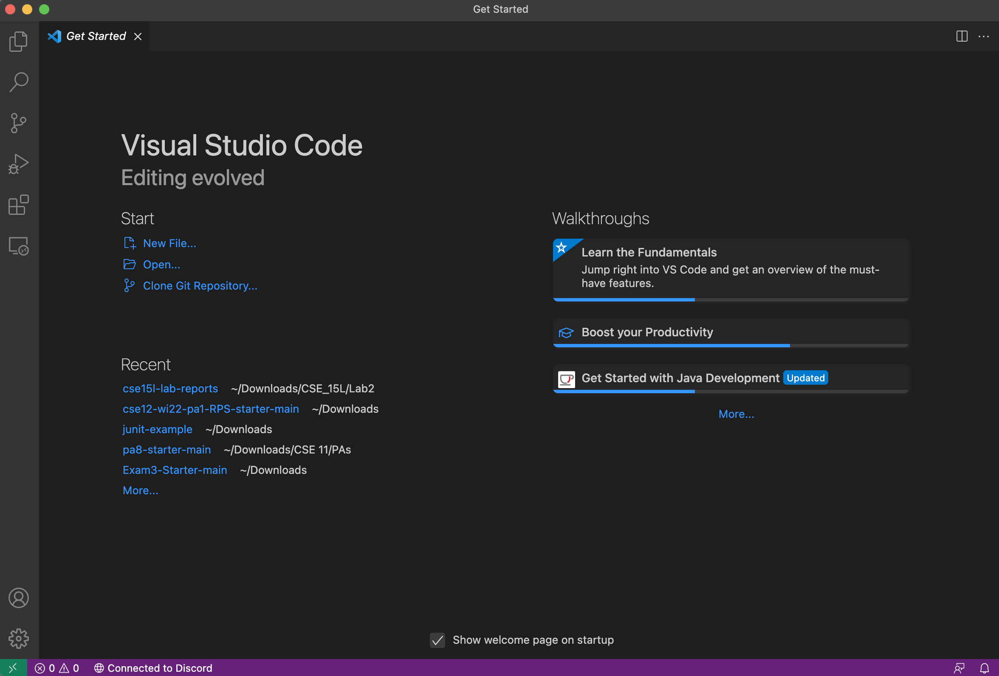
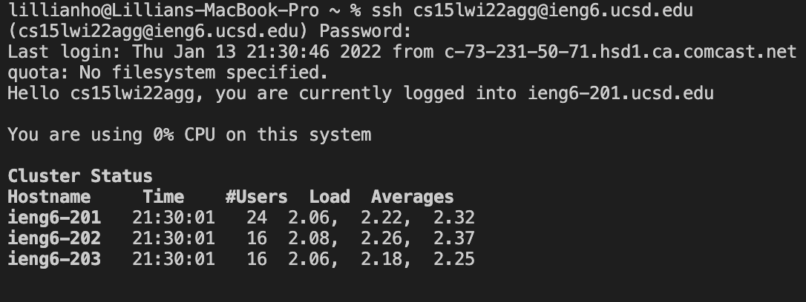
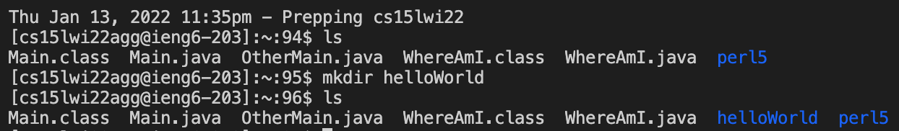
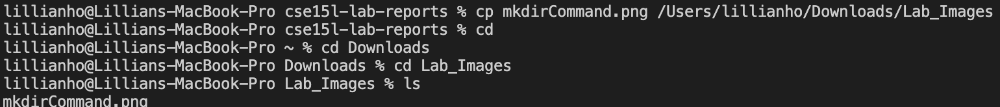
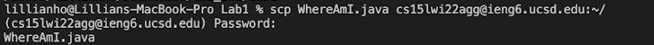

# Lab Report #1: Week 2

## Installing VS Code 

In order to install VS Code, head over to the [Visual Studio Code Website]( https://code.visualstudio.com/) and download the version that corresponds with your operating systems (i.e. OSX for Macs or Windows). 

Be sure to follow the instructions listed on the webpage to ensure VS Code is installed correctly on your device! You should be able to open a window that looks similar to what's shown above. 

## Remotely Connecting 
We'll be using a course-specific account for CSE 15L to connect to a remote server on campus. In order to find this account, visit https://sdacs.ucsd.edu/~icc/index.php. It should resemble this address: cs15lwi22xx@ieng6.ucsd.edu, where xx are the letters on your personal account. Be sure to reset your password for that account to ensure that you'll be able to connect to the server! 

**After everything is set up:**
1. Open VSCode and the terminal (click Terminal and then the "New Terminal" option). 

2. Type the following command into the terminal, and substitute "xx" with letters in your course-specific account:
    ```
    $ ssh cs15lwi22xx@ieng6.ucsd.edu
    ```
3. Since this may be your first time connecting to the server, you may receive an authorization message that asks if whether or not you want to continue - answer saying "yes". Proceed by typing in the password you made for this account (see begining of "Remote Connecting"). 
4. Afterwards, you should see an output similar to what's shown below (though I do not have the authentication message since it is not my first time logging in): 
    

Congratulations! You are now connected to a remote server. 

## Trying Some Commands 
There are a multitude of different commands you could make in the terminal, both on the remote server via the course-specific account and your computer! 

Some commands include the following: 
`cd`, `ls`, `pwd`, `mkdir`, and `cp`. 

Let's try these commands out, along with other variations of them! 
1. `cd` 
* allows users to change the directory 
* adding "~" (tilde) at the end of the command (`cd ~`) 
2. `ls`
* list files/directories in a directory 
* `ls -a` would list all files/directories (including hidden ones). Note: Hidden files/directories are denoted with a "." before its name. 

*`ls -lat` would list all files/directories (including hidden ones). It also lists other information, including who could access certain files, file size, and displays when files were last modified. 

3. `pwd`
* prints the path of the working directory (where the terminal is in)

4. `mkdir` 
* makes a new directory (specify the name of the directory after the `mkdir`)
* i.e. 
 
 (ls is used before and after `mkdir helloWorld` to check if the new directory is created) 
5. `cp`
* copies files/directories to a specific destination

(copied the screenshot used in #4 to a directory named "Lab_Images" in Downloads)

## Moving Files with `scp`
Now, we'll learn about a special command we could use to copy files from your computer to the remote server, or vice versa! 

This command is `scp` - this is always run from the **client**. Below is an example of a standard command you may run to copy a file from your computer to the remote server: 
```
$ scp Hello.java cs15lwi22xx@ieng6.ucsd.edu
```

After running this command, you would be asked to type in your password for the course-specific account, in order to copy the file onto the remote server. 

The file, Hello.java, is being copied to the course specific account. You can check if the file has been copied by connecting to the remote server and running the `ls` command! 

Below is another example of the `scp` command being run. After moving a file named *WhereAmI.java* to the remote server under my course specific account, I was prompted to enter my password to complete the process.




## Setting an SSH Key 
You have probably noticed how time-consuming it might be to type (or copy and paste) our password, everytime we want to connect to the server through `ssh` or copying files using `scp`. 

In order to avoid this proble, we can use `ssh` keys! These keys can be created through the `ssh-keygen` command, which creates a pair of files: the public key and the private key. In order to use these keys, we must copy the public key to the 

## Optimizing Remote Running