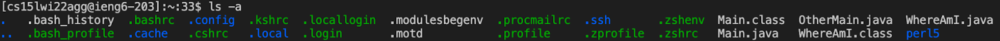

# Lab Report #1: Week 2

## Installing VS Code 

In order to install VS Code, head over to the [Visual Studio Code Website]( https://code.visualstudio.com/) and download the version that corresponds with your operating systems (i.e. OSX for Macs or Windows). 

Be sure to follow the instructions listed on the webpage to ensure VS Code is installed correctly on your device! You should be able to open a window that looks similar to what's shown above. 

## Remotely Connecting 
We'll be using a course-specific account for CSE 15L to connect to a remote server on campus. In order to find this account, visit https://sdacs.ucsd.edu/~icc/index.php. It should resemble this address: cs15lwi22xx@ieng6.ucsd.edu, where xx are the letters on your personal account. Be sure to reset your password for that account to ensure that you'll be able to connect to the server! 

**After everything is set up:**
1. Open VSCode and the terminal (click Terminal and then the "New Terminal" option). 

2. Type the following command into the terminal, and substitute "xx" with letters in your course-specific account:
    ```
    $ ssh cs15lwi22xx@ieng6.ucsd.edu
    ```
3. Since this may be your first time connecting to the server, you may receive an authorization message that asks if whether or not you want to continue - answer saying "yes". Proceed by typing in the password you made for this account (see begining of "Remote Connecting"). 
4. Afterwards, you should see an output similar to what's shown below (though I do not have the authentication message since it is not my first time logging in): 
    

Congratulations! You are now connected to a remote server. 

## Trying Some Commands 
There are a multitude of different commands you could make in the terminal, both on the remote server via the course-specific account and your computer! 

Some commands include the following: 
`cd`, `ls`, `pwd`, `mkdir`, and `cp`. 

Let's try these, along with other variations out! 
1. `cd` 
* allows users to change the directory 
* adding "~" (tilde) at the end of the command (`cd ~`) 
2. `ls`
* list files/directories in a directory 
* `ls -a` would list all files/directories (including hidden ones). Note: Hidden files/directories are denoted with a "." before its name. 

*`ls -lat` would list all files/directories (including hidden ones). It also lists other information, including who could access certain files, file size, and displays when files were last modified. 

## Moving Files with `scp`
## Setting an SSH Key 
## Optimizing Remote Running