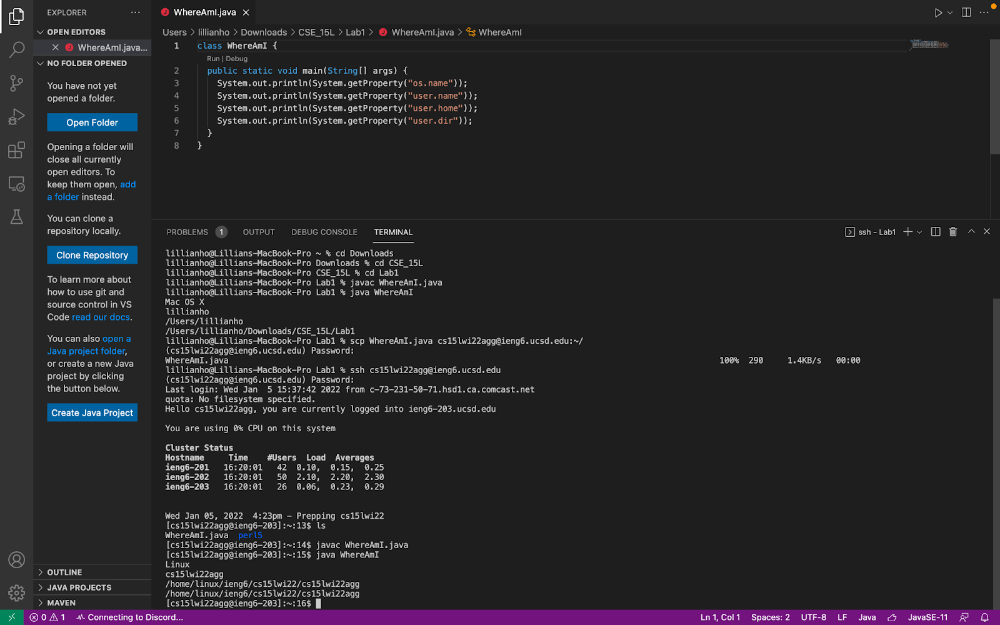

---

# Lab Report #1
## Week 2

### Installing VS Code 

In order to install VS Code, head over to the [Visual Studio Code Website]( https://code.visualstudio.com/) and download the version that corresponds with your operating systems (i.e. OSX for Macs or Windows). 

Be sure to follow the instructions listed on the webpage to ensure VS Code is installed correctly on your device! You be able to open a window that looks similar to what's shown above.  

### Remotely Connecting 

### Trying Some Commands 
### Moving Files with `scp`
### Setting an SSH Key 
### Optimizing Remote Running
