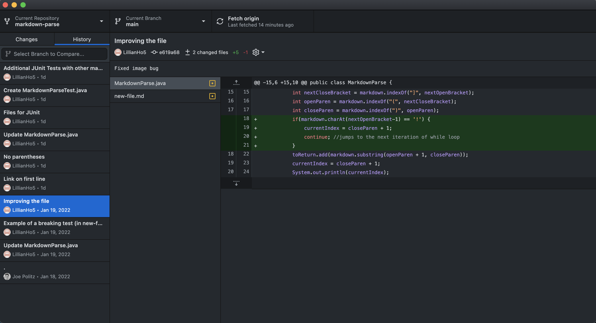
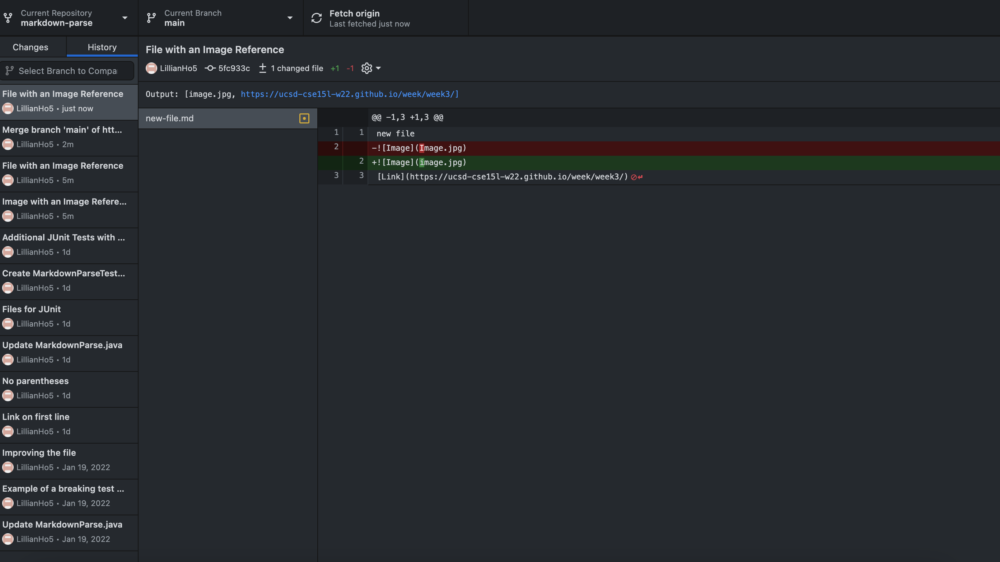
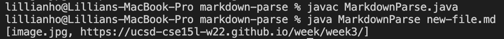
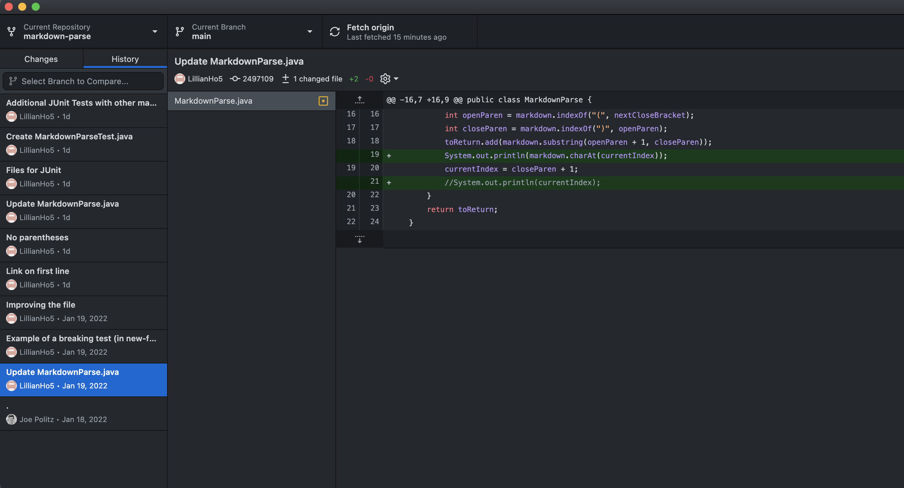
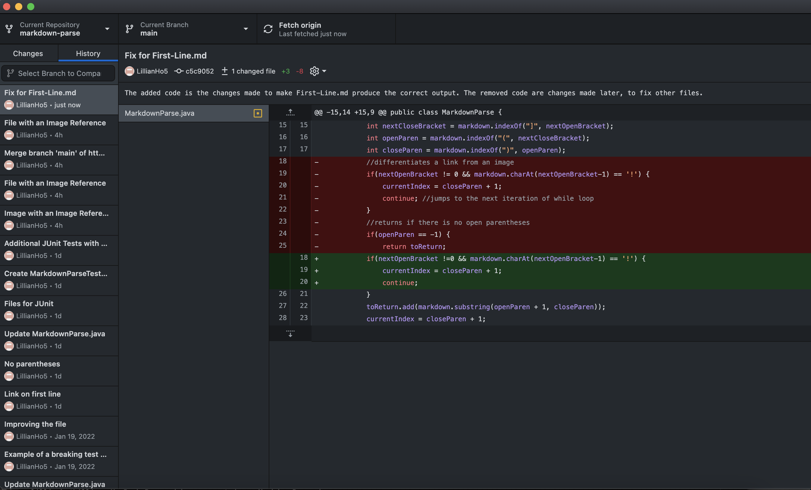
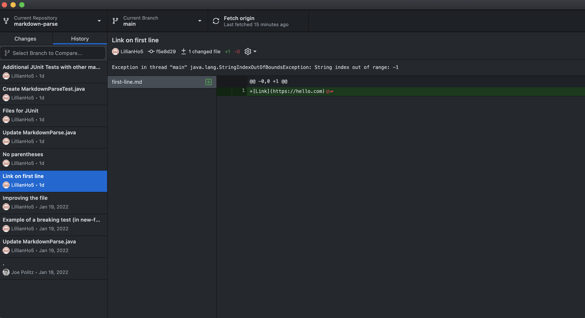
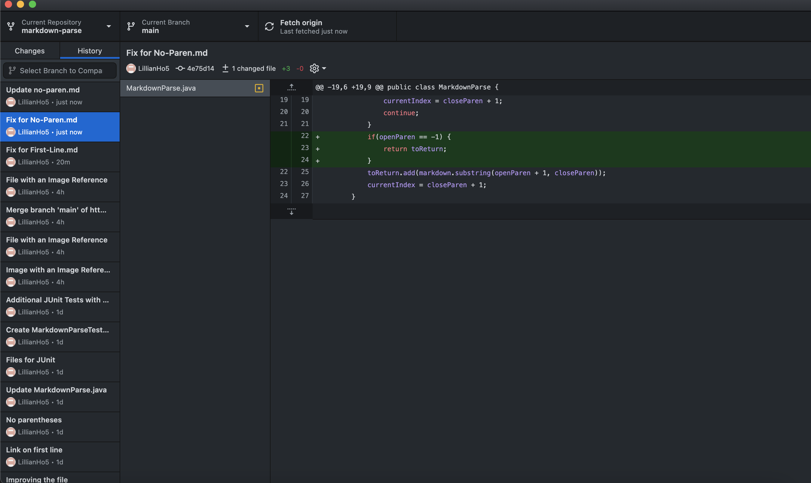
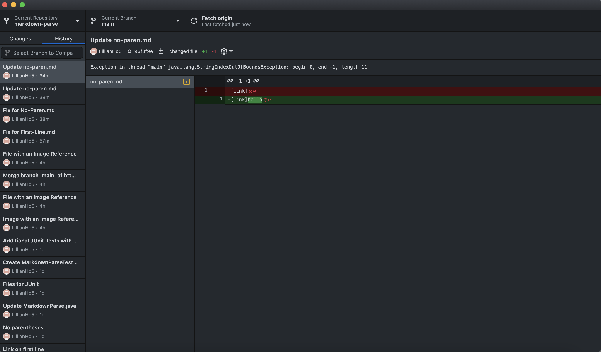
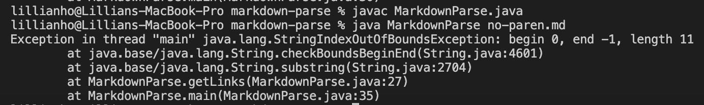

# Lab Report #2: Week 4

## File that Starts with an Image File 

### 1. Code Change Diff: 



### 2. Link to Test File 
[New-File.md](https://github.com/Lillian-Ho/markdown-parse/blob/5fc933c5b5936863c38c11eba59400158ddef370/new-file.md)

### 3. Symptom of Failure-Inducing Output 


MarkdownParse.java initially was unable to distinguish links from images. For example, after finding the index of the opening and closing brackets, the original code considers the content stored between the opening and closing parentheses a link although it may have been an image (**bug** in the code). 
```
 int nextOpenBracket = markdown.indexOf("[", currentIndex);
 int nextCloseBracket = markdown.indexOf("]", nextOpenBracket);
 int openParen = markdown.indexOf("(", nextCloseBracket);
 int closeParen = markdown.indexOf(")", openParen);
 toReturn.add(markdown.substring(openParen + 1, closeParen));
``` 
The file used to produce this symptom was [New-File.md](https://github.com/Lillian-Ho/markdown-parse/blob/5fc933c5b5936863c38c11eba59400158ddef370/new-file.md), contains an image reference along with a link (**failure-inducing input**). 
As a result, rather than receiving the expected output [https://ucsd-cse15l-w22.github.io/week/week3/], [image.jpg, https://ucsd-cse15l-w22.github.io/week/week3/] was produced (**symptom**). 



By using this symptom, my lab group used an if statement to check if the character before the next open bracket was `'!'`. If this was true, we would update currentIndex to be closeParen + 1 and `continue`, avoiding adding the image file to `toReturn`. 


**(MIGHT BE ABLE TO REMOVE)**

In order to debug, my lab group discussed why the image file may have been returned. We used print statements, such as ``System.out.println(markdown.charAt(currentIndex))`` to see what characters were at currentIndex when the program was running. We found out that we needed to distinguish images from links in order to fix the bug (see below).

---

## File with a Link on the First Line 

### 1. Code Change Diff 


### 2. Link to Test File
[First-Line.md](https://github.com/Lillian-Ho/markdown-parse/blob/96f0f9edda45b32e571b207a3a1ba33717cb077a/first-line.md)

### 3. Symptom of Failure-Input 


MarkdownParse.java was unable to produce the expected output ([https://hello.com]) when the markdown file read, [First-Line.md](https://github.com/Lillian-Ho/markdown-parse/blob/96f0f9edda45b32e571b207a3a1ba33717cb077a/first-line.md) (**failure-inducing input**), started with a link. Instead, the output was a StringIndexOutOfBoundsException where "String index out of range: -1" (**symptom**). Looking through the current program, we noticed that the previous if statement written to fix the earlier code change was causing this exception (**bug**). 

```
if(markdown.charAt(nextOpenBracket-1) == '!')
```
The value of nextOpenBracket is 0 since the markdown file starts with a link. Therefore, nextOpenBracket-1 would produce -1, causing the StringIndexOutOfBoundsException. 


In order to fix this, we added onto the if statement and checked if the nextOpenBracket was not equal to 0 before evaluating the statements in the if statement. 
```
if(nextOpenBracket != 0 && markdown.charAt(nextOpenBracket-1) == '!')
```
---

## File with No Parentheses

### 1. Code Change Diff 


### 2. Link to Test File 
[No-Paren.md](https://github.com/Lillian-Ho/markdown-parse/blob/5fc933c5b5936863c38c11eba59400158ddef370/no-paren.md)

### 3. Symptom of Failure-Inducing Output 


When running MarkdownParse with [No-Paren.md](https://github.com/Lillian-Ho/markdown-parse/blob/5fc933c5b5936863c38c11eba59400158ddef370/no-paren.md) (**failure-inducing input**)
in the command line, a StringIndexOutOfBoundsException was thrown, where the a begin, end, and length value of the content in No-Paren.md are indicated(**symptom**). 

The getLinks() method in MarkdownParse continues to look for the opening parentheses and is unable to find it, thus producing a value of -1 for openParen. It also produces a value of -1 for closeParen since a closing parentheses is not present. Since the conditions of the if statement (`if(nextOpenBracket != 0 && markdown.charAt(nextOpenBracket-1) == '!')`) are not fulfilled, the following step occurs: 
```
toReturn.add(markdown.substring(openParen + 1, closeParen))
```
Since the value of openParen is -1 and closeParen is -1, toReturn attempts to add `markdown.substring(0, -1)` to itself, which would cause the symptom to appear (StringIndexOutOfBoundsException). 



In order to fix this, we wrote another if statement, checking if openParen = -1. If this was true, toReturn would be returned, preventing this exception from being thrown. 