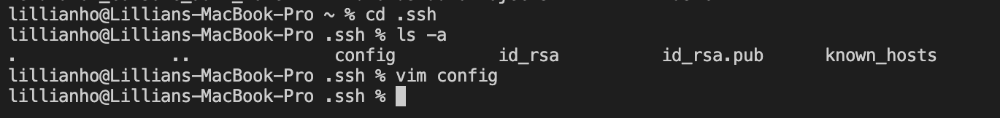
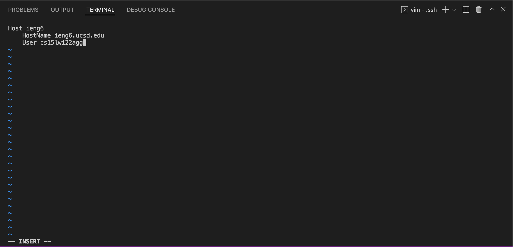
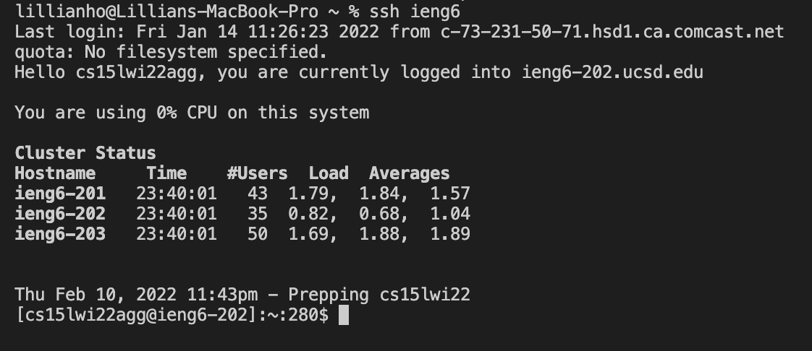
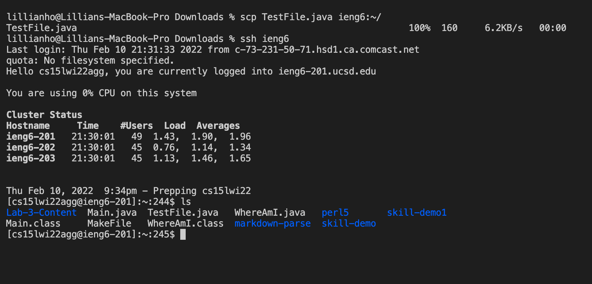

# Lab Report #3: Week 6

## Streamlining ssh Configuration 


### Editing the .ssh/config file in VScode

The `~/.ssh/config` file was created in the `.ssh` directory using the following command since it did not exist beforehand: 
```
$ touch config
```

Afterward, the command `vim config` was used to edit the file, in order to create an alias with the following lines:
```
Host ieng6
    HostName ieng6.ucsd.edu
    User cs15lwi22agg
```
In order to add these lines, I entered INSERT mode by typing i. After adding the lines necessary, I clicked the esc key and typed `:wq` to save changes and exit the Vim editor. 


The alias, **ieng6**, has been created and it can be used instead of the entire cse15l account `cs15lwi22agg@ieng6.ucsd.edu` when running commands with the remote server (i.e. `ssh ieng6` vs. `ssh cs15lwi22agg@ieng6.ucsd.edu`).


### Using ssh to log into cse15l with created alias
As stated previously, creating the alias for the cs15l account allows us to save time with typing. 

For example, instead of the usual 
`ssh cs15lwi22agg@ieng6.ucsd.edu` command being used to connect to the remote server, the following can be used instead: 
```
$ ssh ieng6 
``` 


Running this command generates the same terminal output as running `ssh cs15lwi22agg@ieng6.ucsd.edu`! 

### Using scp to copy a file into cse15l account with created alias
The alias can also be used with other commands, aside from `ssh`, such as `scp`. 



Rather than using the command `scp TestFile.java cs15lwi22agg@ieng6.ucsd.edu:~/`, **cs15lwi22agg@ieng6.ucsd.edu** can be replaced with ieng6, due to the config file we have edited previously. 

The same output that would have been created from  `scp TestFile.java cs15lwi22agg@ieng6.ucsd.edu:~/` is created with: 
```
$ scp TestFile.java ieng6:~/
```