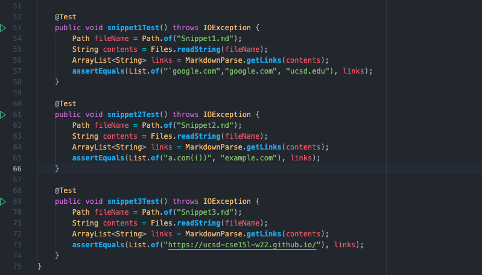
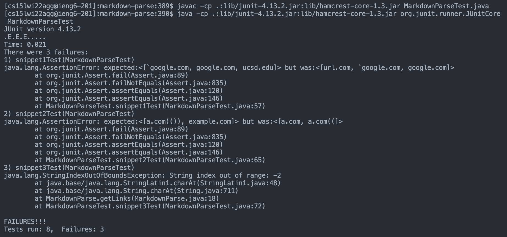
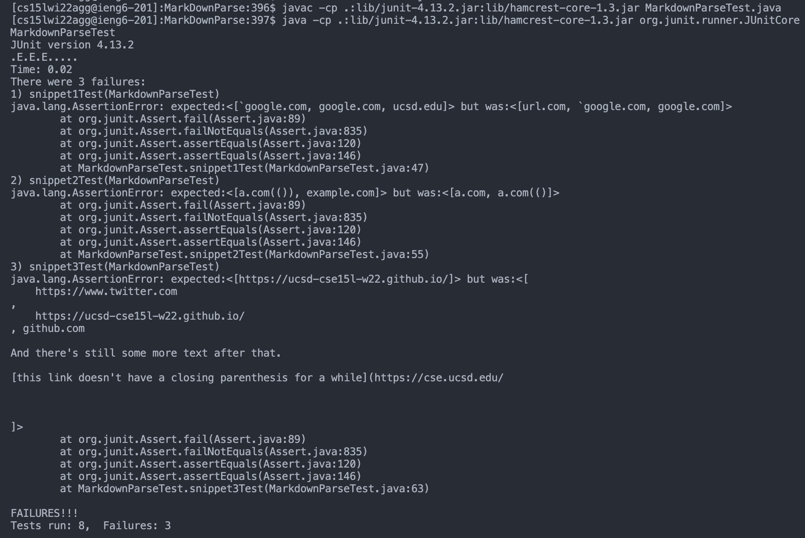
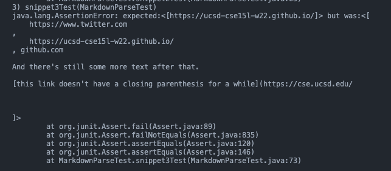

# Lab Report #4: Week 8

## MarkdownParse Implementations: 
1. [My markdown-parse repository](https://github.com/Lillian-Ho/markdown-parse)
2. [The markdown-parse implementation reviewed](PlaceHolder.com) 


## Expected Outputs 
**Snippet 1** 
```
`[a link`](url.com)

[another link](`google.com)`

[`cod[e`](google.com)

[`code]`](ucsd.edu)
``` 
* Expected Output: [google.com, ucsd.edu]
 

**Snippet 2** 
```
[a [nested link](a.com)](b.com)

[a nested parenthesized url](a.com(()))

[some escaped \[ brackets \]](example.com)
```
* Expected Output: [a.com(()), example.com]

**Snippet 3** 
```
[this title text is really long and takes up more than 
one line

and has some line breaks](
    https://www.twitter.com
)

[this title text is really long and takes up more than 
one line](
    https://ucsd-cse15l-w22.github.io/
)


[this link doesn't have a closing parenthesis](github.com

And there's still some more text after that.

[this link doesn't have a closing parenthesis for a while](https://cse.ucsd.edu/


)

And then there's more text
```
* Expected Output: [https://ucsd-cse15l-w22.github.io/]

## Written JUnit Tests (MarkdownParseTest.java)

* These JUnit tests were written in both my implementation of markdown-parse, as well as the implementation reviewed. Markdown files were made for each of the code snippets, such as `Snippet1.md`, `Snippet2.md`, and `Snippet3.md`. 

## Test Results
**My Implementation** 



**Other Implementation**



## Snippet 1 

With my current implementation, I feel that a more involved change might need to occur in order to cover all related cases that use inline code with backticks. 
* For instance, when editing `MarkdownParse.java` to remove the url.com output, an `if` statement should be used to check if the the character before `nextOpenBracket` was a backtick. If it was, `currentIndex` would be updated to be `closeParen + 1` in order to skip over it, followed with `continue`. 

Example implementation: 
```
 if(nextOpenBracket !=0 && markdown.charAt(nextOpenBracket-1) == '`') {
        currentIndex = closeParen + 1; 
        continue; 
    }
```

* When testing the with Snippet 1, I found that while  [`cod[e]`](google.com) was viewed as a link, [`code]`](ucsd.edu) was not detected as a valid site in my implementation. While using `jdb`, I found that the extra closing bracket in between the backticks was thought to be the `nextCloseBracket`. 
    * In order to fix this implementation, another `if` statement may be needed. It should check if the character next to `nextOpenBracket` is a backtick. Additionally, it should look for another backtick and make sure that the character next to it is a closing bracket, or `nextCloseBracket`. If both of these conditions are not satisfied, then `currentIndex` should be updated (`closeParen + 1`) and `continue` should be used in order to move onto the next possible list in the markdown file. 

## Snippet 2 

In order to fix the current implementation to receive the expected output, a more involved change would need to be made, that will most likely exceed 10 lines. My current implementation did not take into account these situations, so many edits may be needed to work with these situations: 

* With nested links, it may be helpful to check for an initial open bracket and see if it exists. Afterwards, if another open bracket is somehow found in the code, that will be kept track of. Right after, a closing bracket would be searched for. If the character to the immediate right of the found closing bracket is an open parentheses, a closing parentheses would be searched for. Finally, a closing bracket should be searched for in order to ensure that there is a nested link within the brackets. An `if` statement can used to verify whether or not these conditions are true (while using `indexOf()` to check if these brackets and parentheses exist). If these conditions are not satisfied, `currentIndex` can be updated to move onto the next supposed link in the markdown file, as well as the `continue` keyword to continue with the while loop. Otherwise, `openParen` can be updated to be the opening parentheses outside of the brackets, as well as `closeParen` in order to get the proper link, which is b.com in this situation.

* Similarly, with nested parentheses, I would need to use an `if` statement to check for situations that have multiple parentheses within parentheses. This may be achieved with a loop, that could check and see if a character at a certain index within the url portion of the link is an open parentheses -- a closing parentheses will be looked for, in order to ensure that the parentheses are properly nested. If these conditions are not satisfied, `currentIndex` can be updated to move onto the next supposed list in the markdown file. The `continue` keyword would file to ensure that we move onto checking the next line with a link. 

* Alternatively, a helper method can be written outside of the getLinks method, meant to find a closing parentheses in situations where there may be nested parentheses within the link. With the method, the first open parentheses would be kept track of. There would a loop that traverses through the "link", looking for other possible open parentheses or a closing parentheses. When all matching closing parentheses are found, the loop will exit, and the method call will be completed. This method call can be called prior to going through the if statements in my implementation (line 18). A similar approach would be used to check for nested closing brackets. 

* With closing brackets that use the backslash character in front of it, an if statement can be used within the previously mentioned helper method, checking if there exists a backslash character in front of the open bracket. Then, a closing bracket with a backslash character would be searched for. If this backslash closing bracket is not found, then the link would not be considered valid. 


## Snippet 3 

In order to determine the source of the `StringIndexOutOfBoundsException`, I ran `javac -g MarkdownParse.java` followed by `jdb MarkdownParse Snippet.md` and `where` to trace through each of the steps. 

Looking through the steps, I found that line 24 of snippet 3 causes this exception, since no `nextOpenBracket` is found, causing line 18 of my implementation (`if(nextOpenBracket != 0 && markdown.charAt(nextOpenBracket-1) == '!'`)) to throw the exception. When removing line 24, I received an output, which did not correspond with the expected output: 



In order to fix my implementation, I would need to make a large change to achieve the correct output. For instance, it appears that links with line breaks in the middle of the link are considered links, when they shouldn't be. Additionally, the link without a closing parentheses is considered a link when it shouldn't have been due to the line breaks. Finally, a link with a closing parenthesis on a different line is considered a link when it shouldn't have been. 

As a result, the fixes required to achieve the correct output may require many lines. It appears that links that have line breaks with parentheses and brackets are not considered links. As a fix, a boolean helper method can be created that specifically works to check for line breaks in a link's line, where the parameter would be the link being looked at (`markdown.substring(openParen + 1, closeParen)`). At every character in the substring, two consecutives `\n` can be searched for. For instance, there can be an `if` statement used to check for the initial `\n`. If that initial `\n` is found, then a nested `if` can check if there's another `\n` afterwards. If this is true, then the method can return true. This method can be used in an `if` statement within `getLinks`, where if it evaluates to true, `currentIndex` would be updated and `continue` would be used to skip the current link and not add it. To avoid the `IndexOutOfBounds` exception from being thrown, in the helper method, an open parenthesis can be checked for prior to going through the loop. If there is no open parenthesis found, false can be returned automatically.